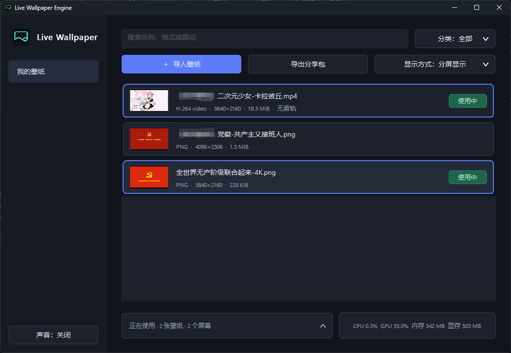

# Live Wallpaper Engine

面向 Windows 10/11 x64 的轻量级、本地动态壁纸软件。支持图片、GIF 和常见视频格式，可按屏幕分配不同壁纸，也可以让一个画面横跨整个桌面。

[下载最新版本](https://github.com/wenchenyang874-a11y/Live_Wallpaper_Engine/releases/latest) · [查看更新记录](CHANGELOG.md) · [Apache-2.0 License](LICENSE)

> 当前开发版本为 `v1.1.1-unreleased`。程序以本地运行为主，不需要账号、服务器或管理员权限；只有用户主动点击“检查更新”时才会访问 GitHub，当前安装包尚未进行代码签名。



## 功能亮点

- **本地、原生、轻量**：使用 C++20、Win32 和 Direct3D 11 实现，不修改 Windows 原壁纸，退出后原壁纸自然恢复。
- **常见壁纸格式**：支持 JPG/JPEG、PNG、BMP、GIF，以及系统 Media Foundation 能够解码的常见视频格式。
- **多屏自由分配**：支持跨屏扩展和分屏显示；分屏模式下，同一壁纸可应用到多个屏幕，不同屏幕也可使用不同壁纸。
- **动态壁纸播放**：GIF 和视频循环播放，视频默认静音，可在主界面或托盘菜单中开关声音、暂停或继续播放。
- **原画优先与可选压缩**：默认按视频原分辨率、原帧率播放；导入时可主动选择“压缩到屏幕分辨率大小”，压缩后的视频会作为实际壁纸保存到本地库，不低于当前显示所需尺寸并保持源帧率，用户选择的来源文件不会被修改。
- **本地壁纸库与分组**：提供全部壁纸、最爱壁纸和可排序的自定义分组；同一壁纸可加入多个分组，搜索只作用于当前分组。
- **通用批量操作**：壁纸支持泛用多选、全选和取消全选，可批量添加到分组、收藏、导出；在全部壁纸中还可确认后批量删除。
- **导入与分享**：可批量导入图片/视频，也可导入或导出标准 ZIP 分享包；每张壁纸独立保存为带 SHA-256 校验的 `.lwewall` 文件。
- **播放与界面解耦**：动态壁纸由独立播放线程驱动，打开菜单、下拉框或对话框不会阻塞桌面取帧与呈现。
- **资源状态可见**：主界面实时显示本进程的 CPU、GPU 和内存，并把 GPU 内存区分为专用与共享。
- **按需检查更新**：标题栏提供“检查更新”按钮，不在启动或后台自动联网；发现新版本后由用户决定是否打开 GitHub Release 下载页。

## 下载与使用

从 [GitHub Releases](https://github.com/wenchenyang874-a11y/Live_Wallpaper_Engine/releases/latest) 下载最新的 Windows x64 安装包。安装程序默认安装到当前用户目录，不需要管理员权限。

1. 点击“导入壁纸”，选择导入图片/视频或分享包；也可以把支持的文件直接拖入窗口。
2. 选择“跨屏扩展”或“分屏显示”。
3. 双击壁纸，或右键选择“应用”。分屏显示时，可在随后出现的窗口中单选或多选目标屏幕。
4. 关闭主窗口会隐藏到系统托盘；左键托盘图标重新打开，右键仅显示播放、声音、取消应用和退出等操作。
5. 需要确认新版本时，点击标题栏“检查更新”；软件不会自动下载或安装更新。检查失败时会显示具体的 HTTP/WinHTTP 原因和可重试时间，并提供仓库 Release 列表作为手动下载入口。

| 类型 | 支持内容 |
| --- | --- |
| 静态图片 | JPG、JPEG、PNG、BMP |
| 动态图片 | GIF |
| 视频 | MP4、M4V、MOV、WMV、AVI 等，实际兼容性取决于 Windows 系统解码器 |
| 分享文件 | 软件导出的 ZIP 分享包、单个 `.lwewall` 文件 |

动态内容会在会话锁定、系统睡眠、显示器关闭，以及检测到符合规则的全屏应用时暂停。顶部 `设置 → 性能优化` 中的“锁屏/熄屏时释放视频资源”默认开启：锁屏或熄屏持续 1 分钟后会关闭视频解码会话并释放转换表面，系统睡眠时立即释放；恢复后自动重建，可能出现短暂卡顿。关闭后仍会暂停播放，但保留解码资源以换取更快恢复。视频使用 Media Foundation/Media Engine 解码并优先利用系统硬件解码能力，4K 视频不再额外限制为 30 FPS；GIF 使用 WIC 按帧解码与合成。

“压缩到屏幕分辨率大小”只作用于本次导入的视频，默认关闭。开启后软件先在后台检查分辨率，只转码高于当前显示需求的视频，再把转码后的 H.264/MP4 文件作为实际壁纸导入；壁纸列表因此会显示压缩后的真实分辨率。分辨率小于或等于屏幕时直接导入来源文件并给出提示。用户选择的来源文件始终不变；图片和 GIF 会在渲染阶段高质量缩放，不额外生成有损副本。

## 多屏显示

- **跨屏扩展**：一个画面覆盖整个虚拟桌面，适合连续构图的超宽壁纸。
- **分屏显示**：每次应用壁纸时选择一个或多个目标屏幕，只替换所选屏幕，其他屏幕继续保留原有分配。

分屏模式支持把同一壁纸分配给多个显示器，也支持逐次为不同显示器设置不同壁纸。同一壁纸用于多个屏幕时会复用解码会话，避免不必要的重复解码。

## 壁纸分组

“全部壁纸”和“最爱壁纸”固定显示在左侧顶部，自定义分组位于分割线下方。自定义分组可以新建、重命名、删除和拖动排序；删除分组只删除分类关系，不会删除壁纸文件。

分组关系是多对多：同一张壁纸可以同时加入多个自定义分组，也可以同时加入最爱。从当前分组移除只影响该分组。右键壁纸可进入通用多选状态，随后批量添加分组、移出当前分组、收藏、导出；批量删除仅在“全部壁纸”中提供，并会再次确认。

## 壁纸分享包

无论导出一张还是多张壁纸，软件都会生成一个标准 ZIP 压缩包。每张壁纸在压缩包中保持独立，多个壁纸不会被合并进同一个 `.lwewall`：

```text
分享包.zip
├── 壁纸 A.lwewall
├── 壁纸 B.lwewall
└── 壁纸 C.lwewall
```

点击“导出分享包”后可多选壁纸，也可以全选或取消全选。导入时既可以选择完整 ZIP，也可以选择解压后的单个 `.lwewall` 文件。媒体文件通常已经压缩，因此 ZIP 使用 Stored 模式打包，避免无意义的二次压缩。

## 本地数据与隐私

软件不会上传壁纸、配置或使用数据。导入媒体时会复制文件到本地壁纸库，而不是只记录原文件路径。除用户点击“检查更新”后向 GitHub 请求 Latest Release 信息外，程序不会为更新功能在启动或后台主动联网，也不会自动下载或执行文件。

| 数据 | 位置 |
| --- | --- |
| 壁纸库 | `%LOCALAPPDATA%\LiveWallpaperEngine\library` |
| 设置 | `%LOCALAPPDATA%\LiveWallpaperEngine\settings.json` |
| 自定义排序 | `%LOCALAPPDATA%\LiveWallpaperEngine\library\.library-order.v1` |
| 最爱与壁纸分组 | `%LOCALAPPDATA%\LiveWallpaperEngine\library\.wallpaper-groups.v1` |
| 日志 | `%LOCALAPPDATA%\LiveWallpaperEngine\logs\LiveWallpaperEngine.log` |
| 上次会话状态 | `%LOCALAPPDATA%\LiveWallpaperEngine\diagnostics\last-session.v1.json` |
| 崩溃转储 | `%LOCALAPPDATA%\LiveWallpaperEngine\crashes` |

崩溃转储文件名包含程序版本、UTC 时间和进程 ID，最多保留最近 10 份。上述诊断数据只保存在本机，不会自动上传。覆盖安装和卸载程序不会主动删除当前用户的壁纸库与设置。

## 技术实现

- 识别 Windows 11 raised desktop 与传统 WorkerW 桌面结构，壁纸窗口不进入 Alt+Tab、不获取焦点，并把鼠标输入交还桌面。
- Windows 11 layered desktop 使用兼容的 D3D11 BitBlt 交换链；静态图片经居中裁剪后只呈现一帧，空闲时使用事件等待而非定时轮询。
- 单实例运行；再次启动程序会唤醒已有主窗口，不会创建第二套渲染器。
- 当前壁纸可从底部上拉列表、壁纸库的“使用中”状态或托盘菜单逐项取消，覆盖窗口会立即隐藏并显露 Windows 原壁纸。
- GPU 指标与任务管理器“进程”页一致，取本进程最繁忙的 GPU 引擎，而不是把不同引擎相加。
- 界面的“内存”采用进程工作集，即当前驻留在物理内存中的部分；为便于普通用户理解，界面不显示“工作集”术语。GPU 内存读取 Windows 进程计数器并分别显示“专用”和“共享”，核显通常主要使用共享内存。

## 构建

需要：

- Visual Studio 2022，并安装“使用 C++ 的桌面开发”。
- Windows 10/11 SDK 10.0.26100.0 或兼容版本。

在 Developer PowerShell 中执行：

```powershell
msbuild .\LiveWallpaperEngine.sln /m /p:Configuration=Release /p:Platform=x64
```

程序输出到 `out\x64\Release\LiveWallpaperEngine.exe`。Release 构建静态链接 MSVC C/C++ 运行库；D3D11、WIC、Media Foundation 等运行依赖由 Windows 10/11 提供，因此无需随安装包附带第三方 DLL。

## 安装包与版本发布

本地构建安装包需要 [Inno Setup 6](https://jrsoftware.org/isinfo.php)：

```powershell
.\tools\build-release.ps1 -Version 1.1.1
```

日常开发验证使用带有明确标记的未发布安装包：

```powershell
.\tools\build-release.ps1 -Version 1.1.1 -Unreleased
```

安装包输出到 `dist\`，默认安装到 `%LOCALAPPDATA%\Programs\Live Wallpaper Engine`。如果检测到已安装的相同 AppId，交互式安装会询问是否覆盖；选择“否”立即退出。确认覆盖后，安装器会先发送专用退出请求，让当前版本快速、完整地释放壁纸窗口和媒体资源；升级不支持该请求的旧版本时，安装器只会短暂等待，再结束经固定窗口类确认的目标进程，避免长时间停在“正在关闭应用程序”。

正式版本使用 `vMAJOR.MINOR.PATCH` 三段式 Git tag。推送合法 tag 后，GitHub Actions 会构建 x64 安装包、生成 SHA-256 校验文件，并创建带有版本说明的 GitHub Release。最新三段式版本会标记为 [Latest Release](https://github.com/wenchenyang874-a11y/Live_Wallpaper_Engine/releases/latest)；`v1.0.0` 起视为稳定版本。

## 测试

程序支持受控运行，下面的命令会显示测试画面并在 10 秒后自动退出：

```powershell
.\out\x64\Release\LiveWallpaperEngine.exe --test-seconds=10
```

仓库提供以下回归脚本：

```powershell
.\tools\test-static-overlay.ps1 -Configuration Release
.\tools\test-media.ps1 -Configuration Release -GifPath .\sample.gif -VideoPath .\sample.mp4
.\tools\test-video-optimizer.ps1 -Configuration Release -VideoPath .\sample-4k.mp4
.\tools\test-compressed-import.ps1 -Configuration Release -VideoPath .\sample-4k.mp4
.\tools\test-multi-display.ps1 -Configuration Release -ImagePath .\sample.png -VideoPath .\sample.mp4
.\tools\test-wallpaper-switch.ps1 -Configuration Release -ImagePath .\sample.png -VideoPath .\sample.mp4
.\tools\test-video-failure-containment.ps1 -Configuration Release -VideoPath .\sample.mp4
.\tools\test-display-mode-ui.ps1 -Configuration Release
.\tools\test-library-management-ui.ps1 -Configuration Release
.\tools\test-wallpaper-groups-ui.ps1 -Configuration Release
.\tools\test-tray-controls.ps1 -Configuration Release
.\tools\test-ui-playback-independence.ps1 -Configuration Release -VideoPath .\sample.mp4
.\tools\test-settings-ui.ps1 -Configuration Release -VideoPath .\sample.mp4
.\tools\test-update-check.ps1 -Configuration Release -ExpectedStatus Current
.\tools\test-crash-diagnostics.ps1 -Configuration Release
```

涉及本地设置和壁纸排序的脚本会在测试后逐字节恢复原文件。媒体和多屏脚本需要调用者提供可用样本及相应硬件环境。

## 常见问题（FAQ）

### 程序意外退出后，在哪里查找诊断信息？

先查看 `%LOCALAPPDATA%\LiveWallpaperEngine\diagnostics\last-session.v1.json`：`clean` 表示正常退出，`crashed` 表示捕获到未处理异常，`unclean` 表示上次运行没有留下正常退出记录，可能被强制结束、断电或遭到系统终止。捕获到异常时，对应的 `.dmp` 文件位于 `%LOCALAPPDATA%\LiveWallpaperEngine\crashes`，可连同日志一起用于定位问题；这些文件不会自动上传。

### 为什么安装目录里看起来只有一个主程序，其他电脑能运行吗？

这是原生轻量化打包的预期结果。主程序已经静态包含 MSVC 运行库，其余动态依赖均为 Windows 10/11 自带的系统组件；壁纸和设置属于当前用户数据，因此不会放在安装目录。正式发布前仍需按兼容矩阵在干净的 Windows 10/11 x64 环境验证。

### 使用腾讯桌面整理后，壁纸不显示或视频闪烁怎么办？

腾讯桌面整理可能会绘制一层系统静态壁纸，覆盖本软件的图片、GIF 或视频；视频持续呈现时，两层画面交替显示还可能表现为闪烁。

请打开腾讯桌面整理的“设置中心 → 桌面整理”，勾选“兼容第三方桌面壁纸”并应用，然后重新应用本软件中的壁纸。本软件不会自动修改第三方软件的设置。

### 为什么软件显示的 GPU 占用与任务管理器“性能”页不同？

软件底部显示的是本进程占用，适合与任务管理器“进程”页中 `Live Wallpaper Engine` 这一行比较；任务管理器“性能”页显示的是整块 GPU 的系统总占用，两者不是同一统计对象。不同采样时刻也可能出现少量波动。

### 为什么十几 MB 的 4K 视频播放后会占用大量 GPU 内存？

文件大小是压缩后的磁盘体积，解码器工作时需要保存多张未压缩帧、硬件解码表面和转换纹理，因此不能按视频文件大小估算运行内存。核显还会从系统内存借用“共享 GPU 内存”。默认模式优先保证原画和源帧率；如果用户在导入时主动选择压缩，软件会把高于屏幕需求的视频转码后再作为实际壁纸导入，用户选择的来源文件不会被修改。

## 许可

本项目采用 [Apache License 2.0](LICENSE) 开源。开发中的变更记录见 [CHANGELOG.md](CHANGELOG.md)。
